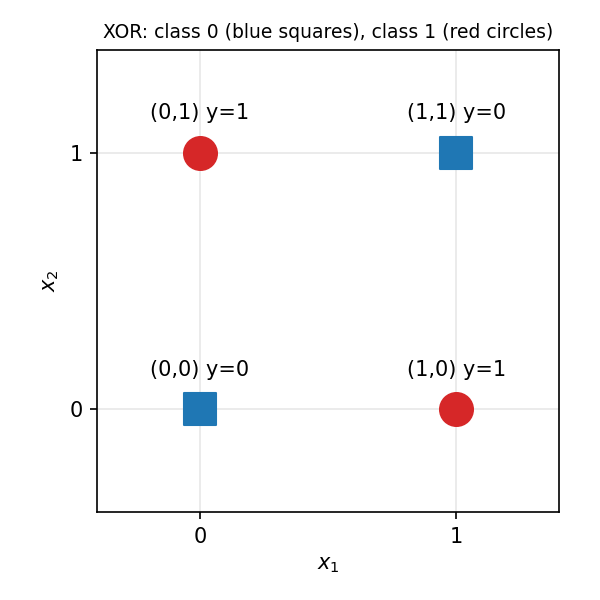
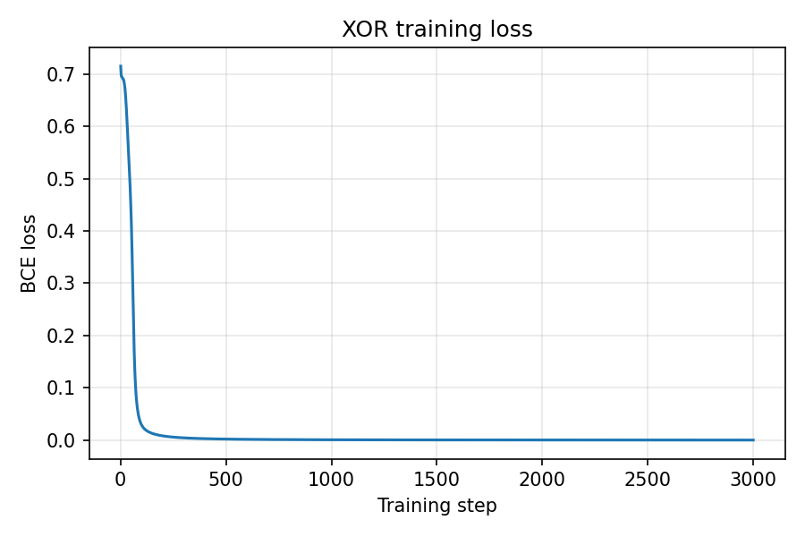

# Task 1

---

### What the agent must compute
- The XOR function, f(x1, x2) = x1 XOR x2, mapping the two binary sensor readings to a single binary output.
- The output is 1 (warning) exactly when the two sensors disagree, and 0 when they agree.
- In practice, the model outputs a probability p in (0, 1), which is thresholded at 0.5 to give the label.

### Input space, output space, and the four labelled examples
- Input space: X = {0, 1}² (since there are two binary sensor readings (x1, x2)).
- Output space: Y = {0, 1}, where 1 means a sensor-disagreement warning.
- Labelled examples:
  - (0, 0) -> 0
  - (0, 1) -> 1
  - (1, 0) -> 1
  - (1, 1) -> 0

### Sketch of the four points

### Why can one straight decision boundary not separate the two classes
- The two class 1 points, (0, 1) and (1, 0), lie on one diagonal, and the two class 0 points, (0, 0) and (1, 1), lie on the other.
- Any straight line that puts both class 1 points on one side also puts at least one class 0 point on that side, so the classes are not linearly separable.

### What will happen if only a single affine transformation followed by a sigmoid is trained
- The model is p = sigmoid(w * x + b). The sigmoid is monotonic, so p > 0.5 exactly when w·x + b > 0. The decision boundary is therefore still a straight line.
- It will fail to learn XOR. At most 3 of the 4 points can be classified correctly.
- Training should settle at w approximately 0, b approximately 0, so p is approximately 0.5 for every input and the loss plateaus near ln 2, approximately 0.693.
- Stacking more affine layers does not help either, since they collapse into a single affine map. The nonlinearity has to sit between layers, in a hidden layer.

---

# Task 2

---

### Model specification
- Architecture: 2 inputs -> 2 hidden units -> 1 output.
- Hidden layer: h = tanh(W1 * x + b1), where W1 is 2x2 and b1 has 2 entries (sigmoid or ReLU will be tried later).
- Output layer: p = sigmoid(W2 * h + b2), where W2 is 1x2 and b2 has 1 entry.
- Loss: binary cross-entropy, L = -[y log p + (1 - y) log(1 - p)].
- Optimiser: gradient-based (e.g. SGD or Adam) with a fixed learning rate.
- Initialisation: small random weights. It must not be identical or zero, or the hidden units stay symmetric.
- Decision rule: predict 1 if p > 0.5, else 0.
- Total of 9 trainable parameters.

### Why is the hidden nonlinearity scientifically necessary here
- Without it, the two layers collapse into a single affine map, so the model is no more expressive than the linear model from Task 1 and cannot represent XOR.
- The nonlinear hidden layer **re-represents** the inputs as new features h, in which the two classes become linearly separable. The output layer can then separate them with a single line.

### Why is sigmoid plus binary cross-entropy a sensible engineering pairing for the output
- The sigmoid keeps p in (0, 1), which lets it be read as P(y = 1 | x) and keeps log p and log(1 - p) defined.
- BCE is the negative log-likelihood of a Bernoulli output, which is what a yes/no target is. Thus, it optimises the _correct_ quantity.
- The pairing gives a clean logit gradient of p - y. The sigmoid derivative p(1 - p) cancels, so learning does not stall when the output is confidently wrong.
- In simple terms, the gradient tells the network how hard to correct itself. It should be big when the network is very wrong, and small when it is nearly right.
- Suppose y = 1 but the network is confidently wrong, with p = 0.01:
  - With BCE, the gradient is p - y = 0.01 - 1 = -0.99. This is a strong signal, so the network corrects itself quickly.
  - Suppose we were instead using squared error. The gradient would keep the extra factor p(1 - p) = 0.01 * 0.99, which is approximately 0.01. The signal is about 100 times weaker, so learning barely moves.
- Squared error is therefore weakest exactly when the network is most wrong. BCE avoids this.

### What evidence will count as successful learning
- Final loss: well below the ln 2 (approximately 0.693) plateau, e.g. under 0.05.
- Predictions: all four inputs are correctly classified after thresholding at 0.5.
- Gradients: the gradient norm of W1 is nonzero early in training, and the loss decreases over training.
- Repeated runs: the above holds across several random seeds, not just one lucky run.

---

# Task 3

---

### Prompt used

Core Task:
Generate minimal PyTorch code for the following model and dataset. Do not change the architecture or task.

Details:
- Dataset: the four XOR examples, given explicitly as tensors: (0, 0) -> 0, (0, 1) -> 1, (1, 0) -> 1, (1, 1) -> 0.
- Model: a 2-2-1 network. The hidden layer has 2 units with a tanh activation. The output layer has 1 unit, producing a logit.
- Loss: BCEWithLogitsLoss (sigmoid binary output, applied inside the loss for numerical stability).
- Initialise the weights randomly (PyTorch default is fine). Set a random seed for reproducibility.
- Training: full-batch (all four examples at once) with Adam (lr = 0.05) for 3000 steps. This must be lightweight enough to run on a CPU in seconds.
- Output: print the initial loss, then after training report the final loss, all four probabilities, the thresholded labels (at 0.5), and the gradient tensor of the first-layer weights after a backward() call. Also plot how the loss changes with each step.

Programming guidelines:
- Keep the code concise, with the forward pass, loss, backward() and optimiser step clearly separated.
- Include brief comments, and explain each test in one sentence.
- Include docstrings where applicable.
- Include type annotations.

### Generated code
Present in the [src](./src/) directory.

### Changed made before execution
None

### Code inspection
- Forward pass: `XORNet.forward`, called as `model(X)` in the training loop. It applies `tanh` after the hidden layer and returns logits.
- Scalar loss: `loss = loss_fn(logits, Y)`, the mean `BCEWithLogitsLoss` over the four examples.
- Reverse-mode AD: `loss.backward()`, which fills each parameter's `.grad`.
- Parameter update: `optimiser.step()` (Adam), after `optimiser.zero_grad()` has cleared the old gradients.

---

# Task 4

---

### Part A: basic learning check
Setting: tanh, seed 0, Adam (lr = 0.05), 3000 steps. No settings needed to be changed.

- Initial loss: 0.7152
- Final loss: 0.000083

| Input | Probability | Predicted label | Target |
|-------|-------------|-----------------|--------|
| (0, 0) | 0.000059 | 0 | 0 |
| (0, 1) | 0.999899 | 1 | 1 |
| (1, 0) | 0.999877 | 1 | 1 |
| (1, 1) | 0.000051 | 0 | 0 |

- All four labels are correct.

- Only one seed was needed here, but this is not representative. See Part D for the results across seeds.

### Part B: backpropagation check
- `parameter.grad` for W1 is dL/dW(1): for each entry of W1, how much the loss changes for a small change in that weight.
- At initialisation (float64), dL/dW(1) = [[0.0005, 0.0006], [-0.0426, -0.0448]].
- The loss is the mean over the four examples, L = (1/4) * sum of L_i. The derivative is linear, so dL/dW = (1/4) * sum of dL_i/dW, which is the average of the example-wise gradients. This was checked numerically, and the two agree (`torch.allclose`).
- Central finite differences on each entry of W1 agree with autograd up to 5.4e-11, so backprop is computing the correct gradient.
- After training, dL/dW(1) is about 1e-6, as expected at a minimum.

### Part C: symmetry experiment
All weights and biases were set to zero (architecture unchanged), and the two rows of W1 were tracked.

| Step | Row 1 of W1 | Row 2 of W1 | Identical? |
|------|-------------|-------------|------------|
| 1 | [0, 0] | [0, 0] | Yes |
| 10 | [0, 0] | [0, 0] | Yes |
| 100 | [0, 0] | [0, 0] | Yes |
| 3000 | [0, 0] | [0, 0] | Yes |

- The rows stay identical. The initial dL/dW(1) is exactly zero, the final loss is 0.6931 (= ln 2), and every probability is 0.5.
- Why: identical hidden units compute the same output and receive the same gradient, so every update moves them by the same amount. With all weights at zero, W2 = 0, so no gradient reaches the hidden layer at all (dL/dh is proportional to W2).
- Extra: with every weight set to the same nonzero value (0.5), the gradient is nonzero, but the two rows still stay identical for all 3000 steps (both reached [-7.77, -7.77]). The loss ends at 0.4774 (probabilities 0, 0.667, 0.667, 0.667), i.e. the network behaves as if it had only one hidden unit.

### Part D: activation experiment
Setting: seed 0, all else fixed. "Early" is the gradient at step 1.

| Hidden activation | Final loss | 4/4 correct? | Early ‖∇W(1)L‖₂ |
|-------------------|------------|--------------|-----------------|
| Sigmoid | 0.4774 | No | 0.0009 |
| Tanh | 0.000083 | Yes | 0.0618 |
| ReLU | 0.6931 | No | 0.0017 |

Repeated over seeds 0-19 (same settings):

| Hidden activation | Runs with 4/4 correct | Mean early norm |
|-------------------|-----------------------|-----------------|
| Sigmoid | 8/20 | 0.0072 |
| Tanh | 9/20 | 0.0329 |
| ReLU | 5/20 | 0.0373 |

Interpretation:
- Engineering observation: the early gradient of the sigmoid network is much smaller than that of the tanh network (about 69x smaller on seed 0, and about 4.6x smaller on average over the 20 seeds).
- Scientific explanation: the sigmoid derivative is at most 0.25, and at initialisation the pre-activations are near 0, so it sits near that maximum. The tanh derivative is near 1 there. Each factor of the chain rule through the hidden layer is therefore smaller for sigmoid.
- The small early gradient did not decide the outcome. Sigmoid and tanh succeeded about equally often (8/20 vs 9/20), and sigmoid's failure on seed 0 was different. Both hidden units learned nearly the same feature (rows of W1 close to (-12, -12) and (14, 14)), so both depend only on x1 + x2 and cannot separate XOR. The loss is stuck at 0.4774, a local minimum with 3 of 4 points correct.
- ReLU: on seeds 3, 4 and 12 both units were dead at initialisation (pre-activation <= 0 for all four inputs), so the early gradient was exactly 0. ReLU failed in 15 of the 20 runs.
- Training for 20000 steps instead of 3000 gave 8/20, 9/20 and 7/20, so most failures are stuck runs and not slow ones.
- From this experiment, I only conclude what happened here: on this seed, and over 20 seeds, with this initialisation and optimiser. Four data points do not show that any activation is best.

### Baselines from Task 1 (linear models)
- A single affine map followed by a sigmoid, and a 2-2-1 network with no hidden activation, were each trained for 3 seeds.
- All six runs ended at loss 0.6931 with every probability equal to 0.5, so predictions are no better than chance. This matches the Task 1 prediction.

---

# Task 5

---

### Predictions (made before running the code)
- Shape of the final weight matrix: 3x2, with a bias of length 3 (one row per class, one column per hidden unit).
- Logits per example: 3, one per class.
- Softmax probabilities sum to one because p_k = exp(z_k) / sum_j exp(z_j). Each term is positive, and dividing by the sum of all the terms normalises the total to 1.
- Why the logit gradient is p - y: with L = -sum_k y_k log p_k and dp_i/dz_k = p_i(delta_ik - p_k), we get dL/dz_k = -sum_i y_i(delta_ik - p_k) = -y_k + p_k * sum_i y_i = p_k - y_k, since the one-hot y sums to 1.

### Modified output design
- Only the output layer and the loss changed: `nn.Linear(2, 3)` produces three logits, and `nn.CrossEntropyLoss` applies softmax and the multiclass cross-entropy. The hidden layer (2 units, `tanh`) is unchanged.
- Labels are the class indices: (0, 0) -> 0, (0, 1) and (1, 0) -> 1, (1, 1) -> 2.

### Results
- Weight matrix shape: (3, 2). Logits per example: 3.
- Initial loss: 1.0591 (close to ln 3 = 1.0986). Final loss: 0.000039.

| Input | Probabilities (class 0, 1, 2) | Predicted class | Target |
|-------|-------------------------------|-----------------|--------|
| (0, 0) | [1.0, 0.0, 0.0] | 0 | 0 |
| (0, 1) | [0.0, 1.0, 0.0] | 1 | 1 |
| (1, 0) | [0.0, 1.0, 0.0] | 1 | 1 |
| (1, 1) | [0.0, 0.0, 1.0] | 2 | 2 |

- All four classes are correct (seed 0).
- For (0, 1): p = [2.34e-05, 0.99997, 7.45e-06], and the sum is 1.00000000.
- Logit gradient check: the gradient of the loss with respect to the logits equals (p - y) / N (`torch.allclose` is True). The 1/N comes from the mean over the N = 4 examples.

### Optional diagnostic: adding 100 to all logits
- The probability vector after adding 100 differs from the original by at most 8.9e-11 (floating-point roundoff), so softmax is shift-invariant.
- A naive `exp(z) / sum(exp(z))` returns nan (in float32, exp(100) is about 2.7e43, above the maximum of about 3.4e38, so it overflows to inf and inf / inf is nan). The max-subtracted version gives the correct vector.
- Stable implementations subtract the maximum logit before exponentiating. This does not change the result, since softmax is shift-invariant, but it makes the largest exponent exp(0) = 1, which cannot overflow.

---

# Reflection questions

---

### What did the XOR experiment demonstrate about the difference between depth and nonlinearity?
- Depth alone does not help. A 2-2-1 network with no hidden activation ended at loss 0.6931 with every probability equal to 0.5, exactly like a single affine map, because stacked affine layers collapse into one.
- Adding a nonlinearity between the layers made it solvable: the tanh network reached a loss of 0.000083 with all four labels correct.
- Nonlinearity is what makes depth useful. It is not automatic, though: with the nonlinearity present, only 9 of 20 seeds succeeded.

### In your successful run, what evidence showed that backpropagation supplied a useful learning signal rather than merely a nonzero gradient?
- The loss fell from 0.7152 to 0.000083, and the four predictions became correct. The loss curve stays near 0.7 for the first few dozen steps, drops sharply by about step 100, and then decreases smoothly.
- The gradient was correct, not just nonzero: it matched central finite differences to 5.4e-11.
- Nonzero alone is not enough. With identical nonzero initialisation the gradient was nonzero, but it was identical for both units, so the network ended at loss 0.4774 with 3/4 correct. Once trained, the gradient shrank to about 1e-6, as expected at a minimum.

### Why did identical/zero weight initialisation prevent the two hidden units from learning distinct features?
- Identical hidden units compute the same output, so they receive the same gradient, so they receive the same update, and stay identical. This was observed for all 3000 steps.
- With zero initialisation, it is worse: W2 = 0, so no gradient reaches the hidden layer at all, and only b2 learns (loss stays at ln 2).
- Random initialisation breaks the symmetry, so the units can take different roles.

### How did changing the hidden activation affect the gradient you observed? Distinguish the scientific explanation from the engineering observation.
- Engineering observation: the early gradient norm on seed 0 was 0.0009 (sigmoid), 0.0618 (tanh) and 0.0017 (ReLU). The mean over 20 seeds was 0.0072, 0.0329 and 0.0373.
- Scientific explanation: the derivative of sigmoid is at most 0.25, the derivative of tanh is about 1 near 0, and the derivative of ReLU is exactly 0 or 1. The chain rule multiplies these factors, so sigmoid shrinks the gradient, and a ReLU unit that is off gives exactly 0.
- The observation depends on the seed, initialisation and scale, so it does not by itself show which activation is better. A smaller early gradient did not predict failure: sigmoid succeeded 8/20 times, tanh 9/20 and ReLU 5/20.

### Why must the output layer and loss be selected together according to the task?
- The output activation defines what the outputs mean, and the loss must match that meaning. Sigmoid outputs are the probability of a Bernoulli variable, so BCE (its negative log-likelihood) is the matching loss. Softmax outputs form a categorical distribution, so multiclass cross-entropy is the matching loss.
- The matched pair gives the clean logit gradient p - y, which is strong when the network is wrong. A mismatched pair (such as sigmoid with squared error) keeps the p(1 - p) factor, and learning stalls when the output is confidently wrong.
- The task decides the pair: one yes/no answer needs one logit with sigmoid, and one of three exclusive classes needs three logits with softmax, so that the probabilities sum to 1.

### Give one example where the LLM improved your engineering productivity and one example where human verification was essential.
- Productivity: given a specific prompt, the LLM produced a complete, working training script on the first attempt, including the loss plot and the printed results. Writing this by hand would have taken longer.
- Verification: the seed-0 tanh run looked perfect (all four correct, loss 0.000083), but only 9 of 20 seeds succeed. Reporting that one run would have been misleading, so the seed sweep and the finite-difference check were needed.
- Also: the generated code printed the gradient after training (about 1e-6, close to zero). Read naively, this suggests no learning signal, but it is the expected value at a minimum. The early gradient had to be measured separately.

### Which tests in this laboratory would you keep if the model were scaled up, and which would become too expensive?
- Keep: monitoring the loss curve, held-out accuracy, gradient norms per layer (they come free with the backward pass), shape and probability-sum checks, an overfit-one-small-batch test, and repeat runs on a few seeds.
- Too expensive: an exhaustive finite-difference gradient check needs two forward passes per parameter, which is fine for 9 parameters but impossible for billions. It can only be done on a small model or a random subset of parameters.
- Also expensive: sweeping many seeds and long training runs, as done in Part D.
