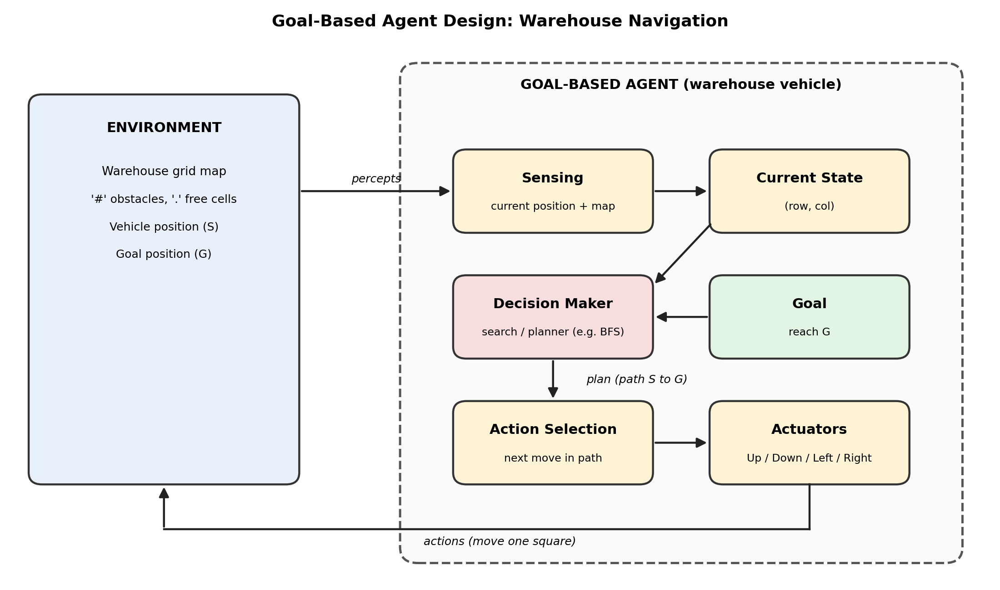

# Task 1

---

### What is the environment
- The warehouse, represented as a 2D grid (7 rows x 21 columns).
- Each cell is either free (`.`) or an obstacle (`#`), with the start `S` and goal `G` marked.
- It is fully observable, deterministic, static, discrete, single-agent, and sequential.

### What is the goal of the agent
To determine a collision-free path from the starting position to the goal position (G), moving one square at a time and never crossing a shelf (#).

### What actions are available to the agent
- Up, Down, Left, Right.
- Each moves the vehicle by one grid square.
- A move into an obstacle or outside the grid is not allowed.

### What information must the agent maintain in order to choose its next action
- Its current position (the current state)
- The goal position
- The map, to check which cells are obstacles
- The set of cells already visited and the path taken so far, to avoid loops and recover the final route

### Why is this an example of a goal-based agent instead rather than a simple reflex agent
- A simple reflex agent uses only the current state with condition-action rules, and has no memory or planning. This would fail here; the map has dead ends and the route to G is not a straight line, so it might get stuck or loop.
- This agent has an explicit goal G and searches for a sequence of actions s0 -> s1 -> ... -> sn in G, using the map and its position to reason about future states.

---

# Task 2

---

(All 5 elements indicated in the task description are explicitly present in the diagram)

---

# Task 3

---

### Prompt used

Core Task:
Write a python script to implement a goal-based agent for the warehouse navigation problem shown in the attached PDF.

Details:
- Represent the warehouse as a two-dimensional grid. The script should be such that it can work with any representation of the given form, not just the one provided. Represent the provided grid as a constant in an appropriate location in the script.
- Determine a collision-free path from S to G, avoiding obstacles. Choose an appropriate search algoritm. Within the code, add a multi-line comment specifying why this algorithm was chosen above others.
- Print the path found from the POV of the agent, i.e., print the sequence of actions that the agent must take to achieve its goal. If no path exists, print an appropriate message.

Programming guidelines:
- Include descriptive comments and docstrings.
- Use type annotations.
- Write explicit tests using pytest or another testing framework to verify that the script works. These tests should verify functionality on other grids as well. Generate some grids for this testing.

---

# Post-task questions

---

### Did the LLM generate a working program on the first attempt?
- Yes.
- Both the core script and the testing script were generated successfully on the first attempt, and I verified both after the fact.

### If not, how can you improve your prompt?
N/A

### What search algorithm did the LLM choose?
BFS

### Why do you think the LLM selected this algorithm?
- I think the problem does naturally lend itself to BFS, and that it was ultimately a natural choice.
- The BFS algorithm was likely VERY well represented in the corpus the LLM was trained on. Being as mainstream as it is, its applications are likely well-understood by the LLM, and this particular scenario ends up being a textbook BFS situation.
- I also think the LLM internally prefers simplicity and familiarity. It chose the simplest option given the described situation.
- In my opinion, the example grid provided also likely strongly motivated this decision. If the LLM were provided with a SIGNIFICANTLY larger grid, where computation might be expensive, I think it would have chosen an otherwise 'faster' algoritm like A*.
- Some of my intuitions about the LLM's choice were verified by the reasoning I asked it to produce and include within the script it wrote.

---
